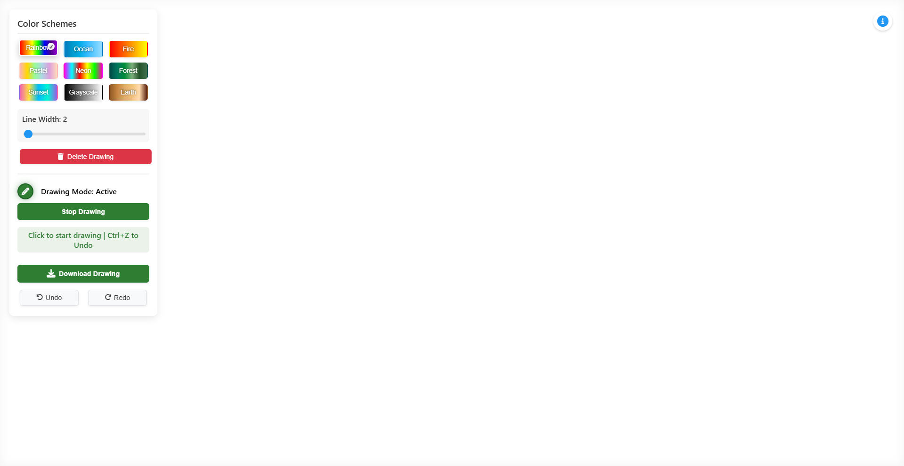

# Interactive Line Drawing App

A creative and interactive web application that lets you draw colorful lines with various effects and customization options. Built with pure HTML, CSS, and JavaScript, this project demonstrates modern web development techniques using SVG for smooth drawing capabilities.



## Features

- 🎨 **9 Different Color Schemes**:

  - Rainbow
  - Ocean
  - Fire
  - Pastel
  - Neon
  - Forest
  - Sunset
  - Grayscale
  - Earth

- 🖌️ **Drawing Controls**:

  - Adjustable line thickness (1-100px)
  - Click-to-draw or click-and-drag functionality
  - Preview line while drawing
  - Start/Stop drawing mode

- ⚡ **Advanced Features**:

  - Undo/Redo support (Ctrl+Z / Ctrl+Y)
  - Download drawings as PNG
  - Clear canvas option
  - Responsive design

- 🎯 **User Interface**:
  - Intuitive traffic light indicator for drawing mode
  - Real-time status messages
  - Info panel with usage instructions
  - Smooth animations and transitions

## Getting Started

### Prerequisites

- A modern web browser (Chrome, Firefox, Safari, Edge)
- No additional dependencies required!

### Installation

1. Clone the repository:
   ```bash
   git clone https://github.com/NotKaede-11/MID.PROG.EXAM
   ```
2. Navigate to the project folder
3. **Important**: Open `index.html` first - it contains a loading animation and will redirect to the drawing app automatically

### Usage

1. Click anywhere on the canvas to start drawing
2. Use the color scheme buttons to change the line colors
3. Adjust line thickness using the slider
4. Use keyboard shortcuts:
   - `Ctrl+Z`: Undo
   - `Ctrl+Y`: Redo
   - `ESC`: Pause drawing mode
5. Click the download button to save your artwork as PNG

## Technical Details

The application uses:

- SVG for smooth line drawing
- Custom CSS animations
- Modern JavaScript event handling
- Local state management for undo/redo functionality
- Responsive design principles

## Project Structure

```
├── index.html          # Entry point with loading animation
├── drawing.html        # Main application
├── css/
│   └── styles.css      # Styling and animations
└── javascript/
    └── script.js       # Core functionality
```

## Contributing

Feel free to fork this project and make your own changes! Some ideas for improvements:

- Add more color schemes
- Implement different brush styles
- Add shape drawing tools
- Save drawings to local storage
- Add touch support for mobile devices

## License

This project is open source and available under the MIT License.

## Credits

- Loading animation by [Emmaline-ozi on UIverse.io](https://uiverse.io/Emmaline-ozi/angry-dragon-5)
- Font Awesome for icons
- [Pencil favicon by Freepik - Flaticon](https://www.flaticon.com/free-icons/pencil)

## Support

If you encounter any issues or have suggestions, please open an issue in the GitHub repository.

---

Made with ❤️ by Ryu
